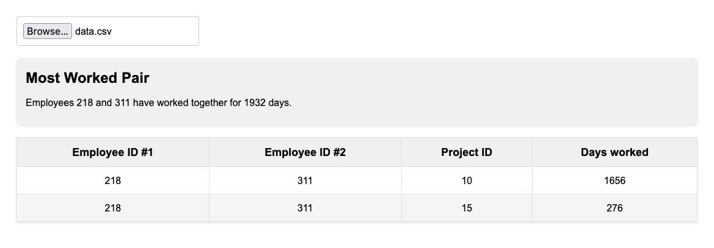

# Nikolay-Cherepov-employees

The Employee Project Tracker is a web application built with React and Vite that allows you to analyze and identify pairs of employees who have worked together on common projects for the longest period of time.

## Features

- Upload a CSV file containing employee project data.
- Analyze the data to find pairs of employees who have worked together the most.
- Display a table of common projects for the pair with the longest collaboration.

## Libraries Used

- React: A popular JavaScript library for building user interfaces.
- Vite: A fast build tool that serves your code via native ES modules.
- PapaParse: A library for parsing CSV data easily.
- Moment.js: A library for parsing, manipulating, and formatting dates and times.

## CSV File Format

The application expects a CSV file with the following format:

- No headers in the CSV file.
- No spaces between columns.
- Each row should contain the following columns in order:
  1. Employee ID
  2. Project ID
  3. Start Date
  4. End Date

Example CSV data:

```
143,12,2013-11-01,2014-01-05
218,10,2012-05-16,NULL
143,10,2009-01-01,2011-04-27
818,12,2013-11-07,2013-11-21
311,10,2014-03-04,2018-09-14
218,15,2017-04-05,2018-06-05
311,15,2017-09-03,2019-11-09
```

## Usage

```bash
cd employee-project-tracker
npm install
npm run dev
```

## App Preview
